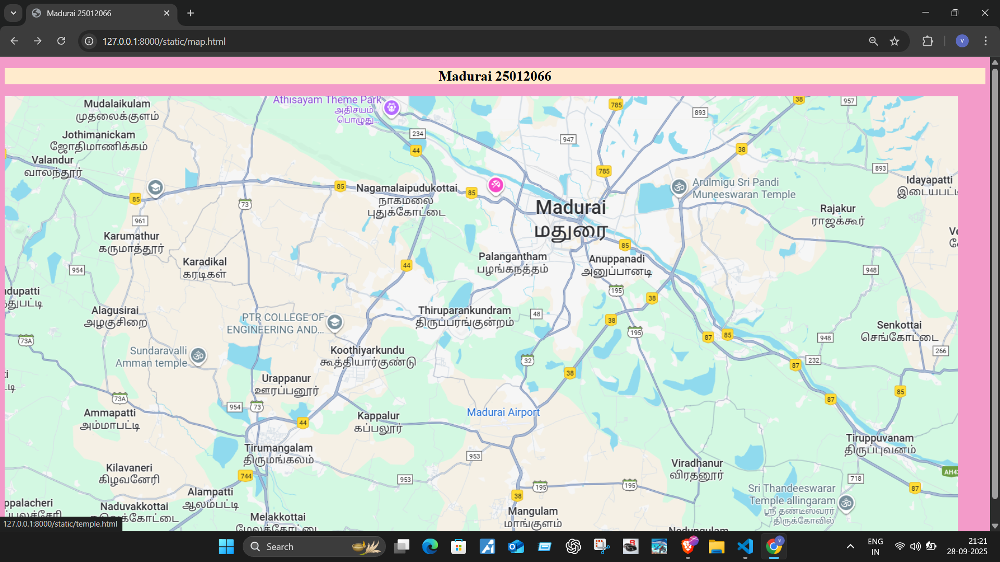
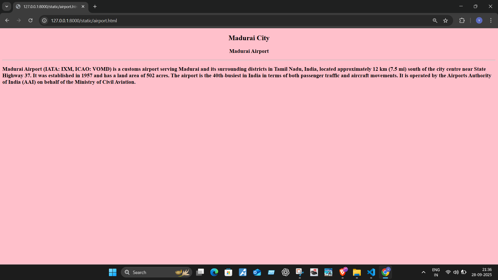
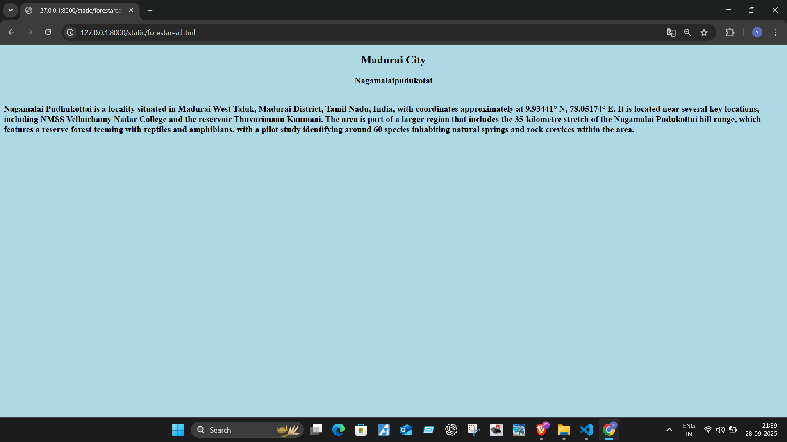
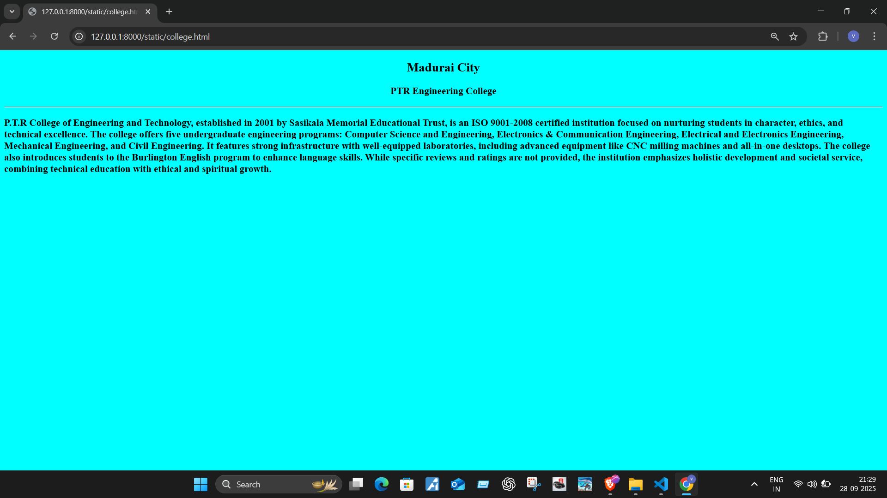
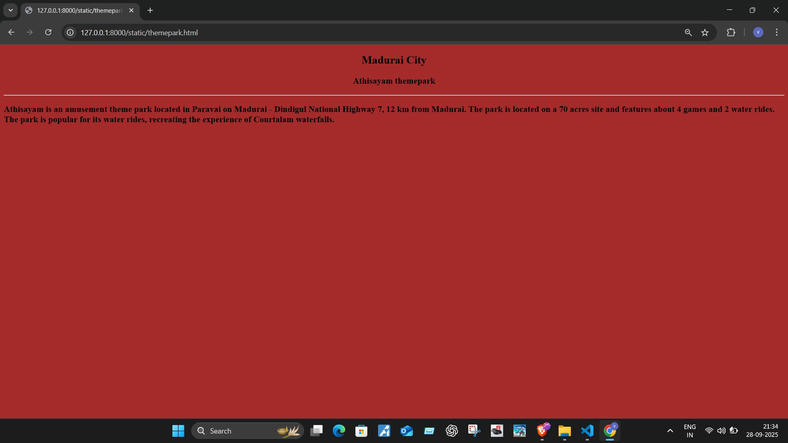
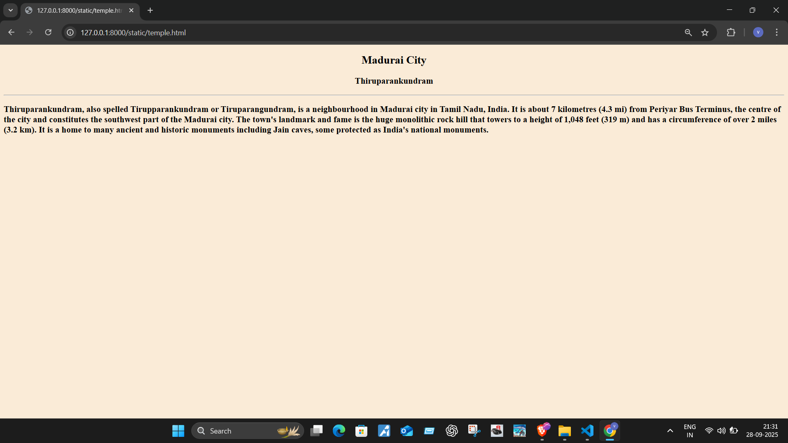

# Ex04 Places Around Me
## Date: 29-9-2025

## AIM
To develop a website to display details about the places around my house.

## DESIGN STEPS

### STEP 1
Create a Django admin interface.

### STEP 2
Download your city map from Google.

### STEP 3
Using ```<map>``` tag name the map.

### STEP 4
Create clickable regions in the image using ```<area>``` tag.

### STEP 5
Write HTML programs for all the regions identified.

### STEP 6
Execute the programs and publish them.

## CODE
```
map.html
<!DOCTYPE html>
<html>
    <head>
        <title>Madurai 25012066</title>
        <link rel="stylesheet" href="style.css">
    </head>
    <body>
        <h2> Madurai 25012066</h2>
        

        <map name="image-map">
            <area target="" alt="Madurai Airport" title="Madurai Airport" href="airport.html" coords="785,522,918,551" shape="rect">
            <area target="" alt="Athisayam Theme Park" title="Athisayam Theme Park" href="themepark.html" coords="595,29,44" shape="circle">
            <area target="" alt="PTR College" title="PTR College" href="college.html" coords="391,361,572,354,550,413,378,413,373,381" shape="poly">
            <area target="" alt="Thiruparankundram" title="Thiruparankundram" href="temple.html" coords="774,361,66" shape="circle">
            <area target="" alt="Nagamalaipudukotai" title="Nagamalaipudukotai" href="forestarea.html" coords="694,166,60" shape="circle">
        </map>
    </body>
</html>


airport.html
<!DOCTYPE html>
<html>
    <head>
        <title>Nearme airport</title>
    </head>
    <body bgcolor="pink">
        <h2 align="center">Madurai City</h2>
        <h3 align="center">Madurai Airport</h3>
        <hr>
        <h3>Madurai Airport (IATA: IXM, ICAO: VOMD) is a customs airport serving Madurai and its surrounding districts in Tamil Nadu, India, located approximately 12 km (7.5 mi) south of the city centre near State Highway 37.
 It was established in 1957 and has a land area of 502 acres.
 The airport is the 40th-busiest in India in terms of both passenger traffic and aircraft movements.
 It is operated by the Airports Authority of India (AAI) on behalf of the Ministry of Civil Aviation.</h3>
    </body>
</html>


college.html
<!DOCTYPE html>
<html>
    <head>
        <title>Nearme college</title>
    </head>
    <body bgcolor="cyan">
        <h2 align="center">Madurai City</h2>
        <h3 align="center">PTR Engineering College</h3>
        <hr>
        <h3>P.T.R College of Engineering and Technology, established in 2001 by Sasikala Memorial Educational Trust, 
is an ISO 9001-2008 certified institution focused on nurturing students in character, ethics, and technical excellence.
The college offers five undergraduate engineering programs: Computer Science and Engineering, Electronics & Communication Engineering, 
Electrical and Electronics Engineering, Mechanical Engineering, and Civil Engineering. 
It features strong infrastructure with well-equipped laboratories, including advanced equipment like CNC milling machines and all-in-one 
desktops. The college also introduces students to the Burlington English program to enhance language skills. While specific reviews and 
ratings are not provided, the institution emphasizes holistic development and societal service, combining technical education with 
ethical and spiritual growth.

        </h3>
    </body>
</html>


forestarea.html
<!DOCTYPE html>
<html>
    <head>
        <title>Nearme forestarea</title>
    </head>
    <body bgcolor="lightblue">
        <h2 align="center">Madurai City</h2>
        <h3 align="center">Nagamalaipudukotai</h3>
        <hr>
        <h3>Nagamalai Pudhukottai is a locality situated in Madurai West Taluk, Madurai District, Tamil Nadu, India, with coordinates approximately at 9.93441° N, 78.05174° E.
 It is located near several key locations, including N. M. S. S. Vellaichamy Nadar College and the reservoir Thuvarimaan Kanmaai.
 The area is part of a larger region that includes the 35-kilometer stretch of the Nagamalai Pudukottai hill range, which features a reserve forest teeming with reptiles and amphibians, with a pilot study identifying around 60 species inhabiting natural springs and rock crevices within the area.</h3>
    </body>
</html>


temple.html
<!DOCTYPE html>
<html>
    <head>
        <title>Nearme temple</title>
    </head>
    <body style="background-color: antiquewhite;" >
        <h2 align="center">Madurai City</h2>
        <h3 align="center">Thiruparankundram</h3>
        <hr>
        <h3>Thiruparankundram, also spelled Tirupparankundram or Tiruparangundram, is a neighbourhood in Madurai city in Tamil Nadu, India. It is about 7 kilometres (4.3 mi) from Periyar Bus Terminus, the centre of the city and constitutes the southwest part of the Madurai city. The town's landmark and fame is the huge monolithic rock hill that towers to a height of 1,048 feet (319 m) and has a circumference of over 2 miles (3.2 km). It is a home to many ancient and historic monuments including Jain caves, some protected as India's national monuments.</h3>
    </body>
</html>


themepark.html
<!DOCTYPE html>
<html>
    <head>
        <title>Nearme themepark</title>
    </head>
    <body bgcolor="brown">
        <h2 align="center">Madurai City</h2>
        <h3 align="center">Athisayam themepark</h3>
        <hr>
        <h3>Athisayam is an amusement theme park located in Paravai on Madurai - Dindigul National Highway 7, 12 km from Madurai. The park is located on a 70 acres site and features about 4 games and 2 water rides. The park is popular for its water rides, recreating the experience of Courtalam waterfalls.</h3>
    </body>
</html>
```

## OUTPUT








## RESULT
The program for implementing image maps using HTML is executed successfully.
